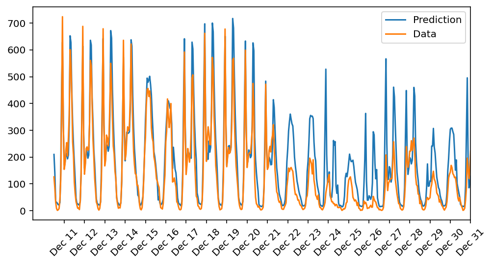

<h1 align="center">Bike-Sharing-Prediction</h1>

<p align="center"><i>Do you have any question? Contact me on <a href="https://www.linkedin.com/in/saleh-sargolzaee">LinkedIn</a></i></p>
<br>
In this project, I built a neural network from scratch to carry out a prediction problem on a real dataset comes from the <a href = "https://archive.ics.uci.edu/ml/datasets/Bike+Sharing+Dataset">UCI Machine Learning Database</a>.
It's one of My Udacity projects that I have made to improve my skills in building a neural network from the ground up.


Please don't use it to copy the project. 


## Result preview

As we can see, the model overestimates bike ridership in December because it hasn't had sufficient holiday season training examples. The predictions generally are quite accurate, though!



## Getting Started


1. Clone the repo
   ```sh
   git clone https://github.com/salehsargolzaee/Bike-Sharing-Prediction
   ```
2. Change directory to repo folder
   ```sh
   cd path/to/repo/folder
   ```
3. Create an environment with required packages
   ```sh
   conda env create -f environment.yaml
   conda activate bike-sharing-prediction
   ```
- or you can use `pip`:

   ```sh
   pip install -r requirements.txt
   ```
4. Run `jupyter notebook`
    
   ```sh
   jupyter notebook
   ```
5. Open `Predicting_bike_sharing_data.ipynb`


## Contact

Saleh Sargolzaee - [LinkedIn](https://www.linkedin.com/in/saleh-sargolzaee) - salehsargolzaee@gmail.com

Project Link: [https://github.com/salehsargolzaee/Bike-Sharing-Prediction](https://github.com/salehsargolzaee/Bike-Sharing-Prediction)

<p align="right">(<a href="#top">back to top</a>)</p>

## :man_astronaut: Show your support

Give a ⭐️ if this project helped you!
